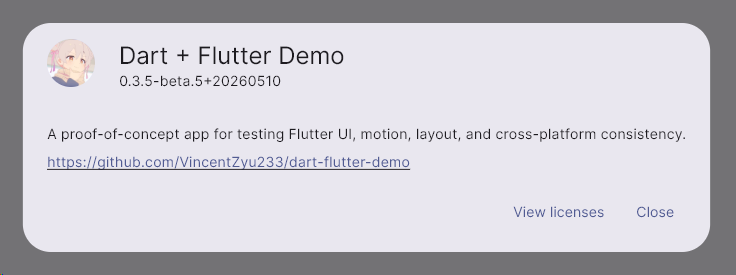
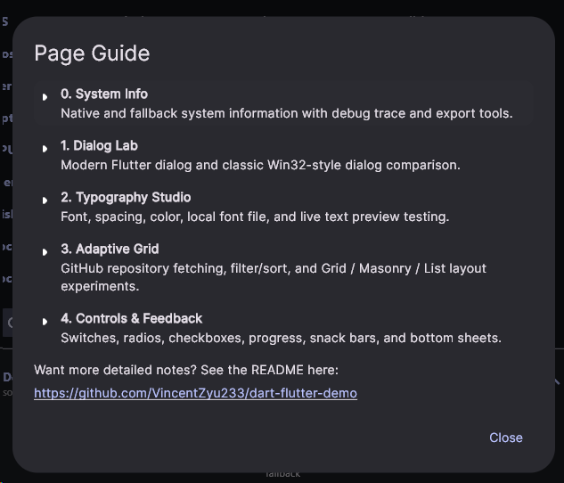

# dart_flutter_demo

A cross-platform Flutter UI showcase PoC (Proof of Concept) app, available on Android, Windows, Linux, macOS, and iOS, build by Github Action CI packaging workflow.

## Dialogs

### About

An app information dialog that displays app name, version, build number, publisher, and related links. Accessible from the AppBar menu.

### Getting Started Guide

A step-by-step walkthrough dialog showing the app's download channels, build options, and recommended development setup. Accessible from the AppBar menu.

## Pages

### 0. System Info

Displays system information through native C++ (Windows), Kotlin (Android), Swift (iOS), and dart:io fallbacks. Shows OS, hostname, kernel, uptime, CPU, memory, disk, and local IP. Includes built-in debug trace viewing plus copy/export actions for diagnostics.
Source: [lib/pages/page0_system_info.dart](https://github.com/VincentZyu233/dart-flutter-demo/blob/main/lib/pages/page0_system_info.dart)

### 1. Dialog Lab

A compact dialog lab with both a modern Flutter dialog and a classic Win32-style dialog recreation. Uses retro borders, inset input styling, and larger action buttons to demonstrate that Flutter can reproduce very different interaction and visual languages in one app.
Source: [lib/pages/page1_dialog_lab.dart](https://github.com/VincentZyu233/dart-flutter-demo/blob/main/lib/pages/page1_dialog_lab.dart)

### 2. Typography Studio

An interactive text playground. Adjust font size, letter spacing, and line height with live controls. Switch between the system font, Google Fonts, and a one-shot local font file. Includes live preview text editing, dark/light auto text color switching, preset swatches, and a custom color picker with RGB and HEX readout.
Source: [lib/pages/page2_typography_studio.dart](https://github.com/VincentZyu233/dart-flutter-demo/blob/main/lib/pages/page2_typography_studio.dart)

### 3. Adaptive Grid

A responsive GitHub repository browser driven by LayoutBuilder. Fetches repositories from configurable personal or organization repository pages, supports proxy configuration, filter and sort controls, collapsible configuration UI, layout switching between Grid / Masonry / List, and adjustable target columns from 5 to 1.
Source: [lib/pages/page3_adaptive_grid.dart](https://github.com/VincentZyu233/dart-flutter-demo/blob/main/lib/pages/page3_adaptive_grid.dart)

### 4. Controls & Feedback

A compact lab for interactive controls and user feedback. Includes radios, checkboxes, switches, progress indicators, snack bars, and bottom sheets. Useful for checking state transitions, motion, and component responsiveness.
Source: [lib/pages/page4_controls_feedback.dart](https://github.com/VincentZyu233/dart-flutter-demo/blob/main/lib/pages/page4_controls_feedback.dart)

## CI/CD

GitHub Actions handles automated builds and packaging. Push a commit containing `build action` or `build release` to trigger the pipeline. See [build.md](.github/workflows/build.md) for details.

## Troubleshooting

- **Linux / Windows GPU issues**: Launch with software rendering: `./dart_flutter_demo --disable-gpu`
- **macOS virtual machines graphic issues** (VMware, VirtualBox, etc.): Flutter desktop apps require Apple Metal, which is unavailable in VMs. Use a physical Mac or [GitHub Actions macOS runners](https://github.com/VincentZyuApps/mac-test-action-runner) instead.

## Tech Stack

| Item | Badge |
|------|-------|
| Flutter |  |
| Material 3 |  |
| Fonts |  |
| Plugins |  |
| App Info |  |
| Links |  |
