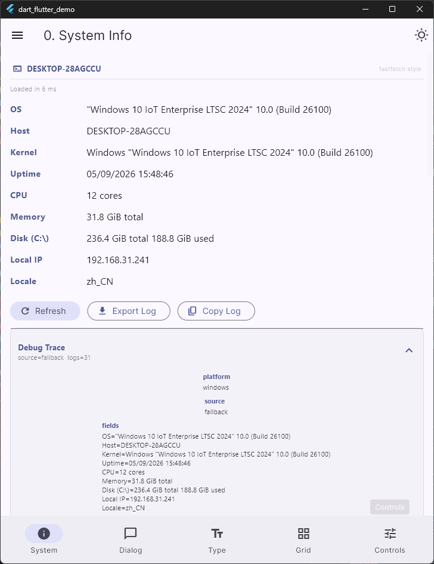
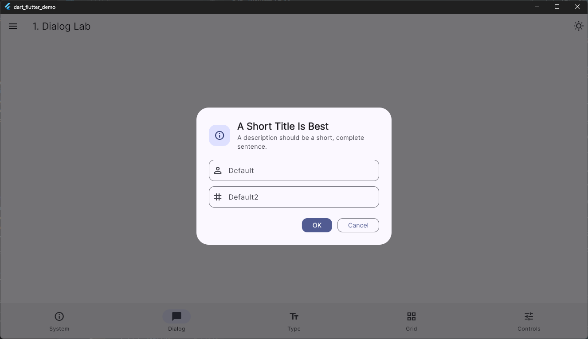
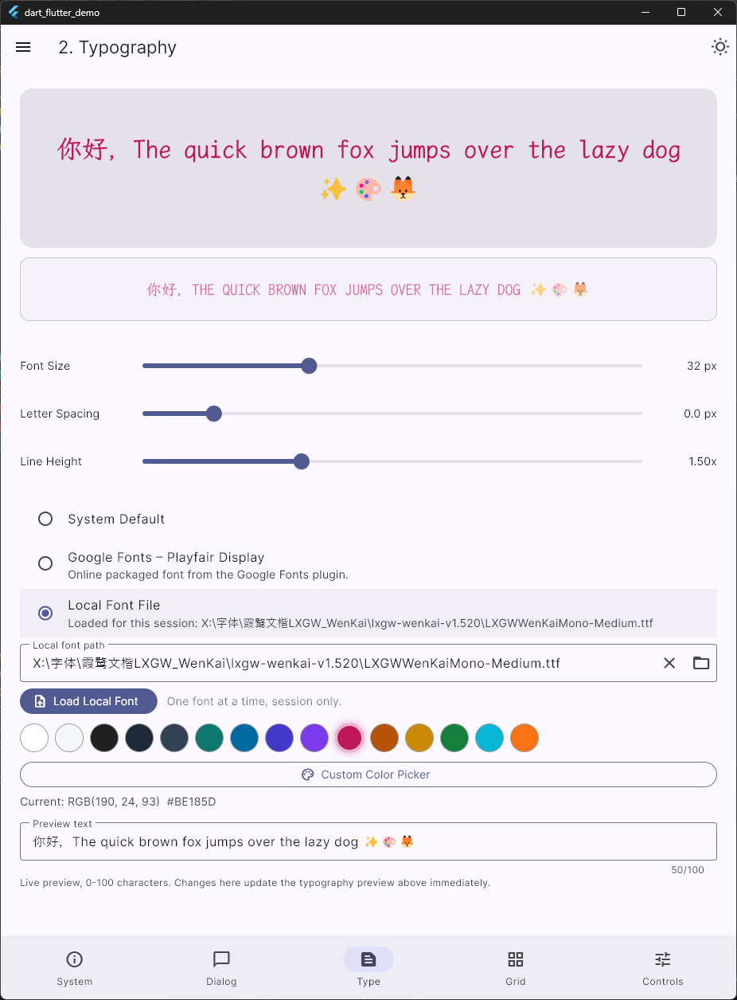
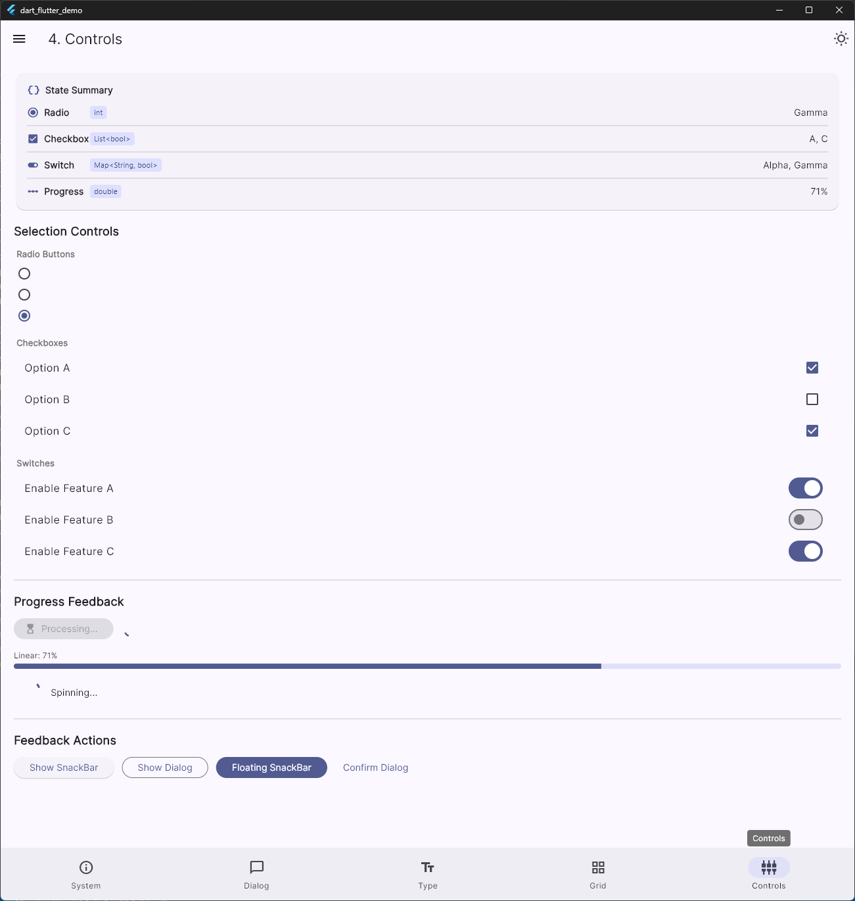

# dart_flutter_demo

一个面向 Android、Windows、Linux，并带有 macOS 与 iOS CI 打包链路的跨平台 Flutter UI 展示 PoC（Proof of Concept）应用。

## 页面介绍

### 0. 系统信息实验室

通过原生 C++（Windows）、Kotlin（Android）、Swift（iOS）以及 dart:io fallback 获取系统信息。展示 OS、主机名、内核、运行时间、CPU、内存、磁盘和本地 IP。内置调试链路查看、复制与导出能力，便于诊断采集过程。
源码： [lib/pages/page0_system_info.dart](https://github.com/VincentZyu233/dart-flutter-demo/blob/main/lib/pages/page0_system_info.dart)


### 1. 对话框实验室

一个同时包含现代 Flutter 对话框与经典 Win32 风格对话框复刻的紧凑实验页。使用复古边框、内凹输入框样式和更大的操作按钮，展示 Flutter 可以在同一个应用里还原非常不同的交互与视觉语言。
源码： [lib/pages/page1_dialog_lab.dart](https://github.com/VincentZyu233/dart-flutter-demo/blob/main/lib/pages/page1_dialog_lab.dart)


### 2. 文字排版工作室

一个交互式文字实验场。通过实时控件调整字号、字间距和行高。在系统字体、Google Fonts 和一次性本地字体文件之间切换。包含实时预览文本编辑、深浅色主题自动文字颜色切换、预设色板，以及带 RGB 与 HEX 读数的自定义颜色选择器。
源码： [lib/pages/page2_typography_studio.dart](https://github.com/VincentZyu233/dart-flutter-demo/blob/main/lib/pages/page2_typography_studio.dart)


### 3. 自适应网格

一个由 LayoutBuilder 驱动的响应式 GitHub 仓库浏览页。可从可配置的个人或组织仓库页面抓取数据，支持代理设置、筛选与排序控件、可折叠配置区、Grid / Masonry / List 布局切换，以及从 5 到 1 的目标列数调整。
源码： [lib/pages/page3_adaptive_grid.dart](https://github.com/VincentZyu233/dart-flutter-demo/blob/main/lib/pages/page3_adaptive_grid.dart)


### 4. 控件与反馈实验室

一个用于交互控件与反馈模式的紧凑实验页。包含单选框、多选框、开关、进度指示器、SnackBar 和 BottomSheet。适合检查状态切换、动效反馈与组件响应性。
源码： [lib/pages/page4_controls_feedback.dart](https://github.com/VincentZyu233/dart-flutter-demo/blob/main/lib/pages/page4_controls_feedback.dart)


## 构建与运行

```bash
# 安装依赖
flutter pub get

# 调试模式运行
flutter run

# Release 构建
flutter build windows --release
flutter build linux --release
flutter build apk --release
```

## CI/CD

GitHub Actions 负责自动构建与打包。提交信息包含 `build action` 或 `build release` 即可触发流水线。详见 [build.zh-cn.md](.github/workflows/build.zh-cn.md)。

## 技术栈

- Flutter（stable 通道）
- Material 3 设计系统
- Google Fonts 插件
- file_selector + flutter_colorpicker 插件
- 状态管理：setState（刻意保持 PoC 的简单性）
